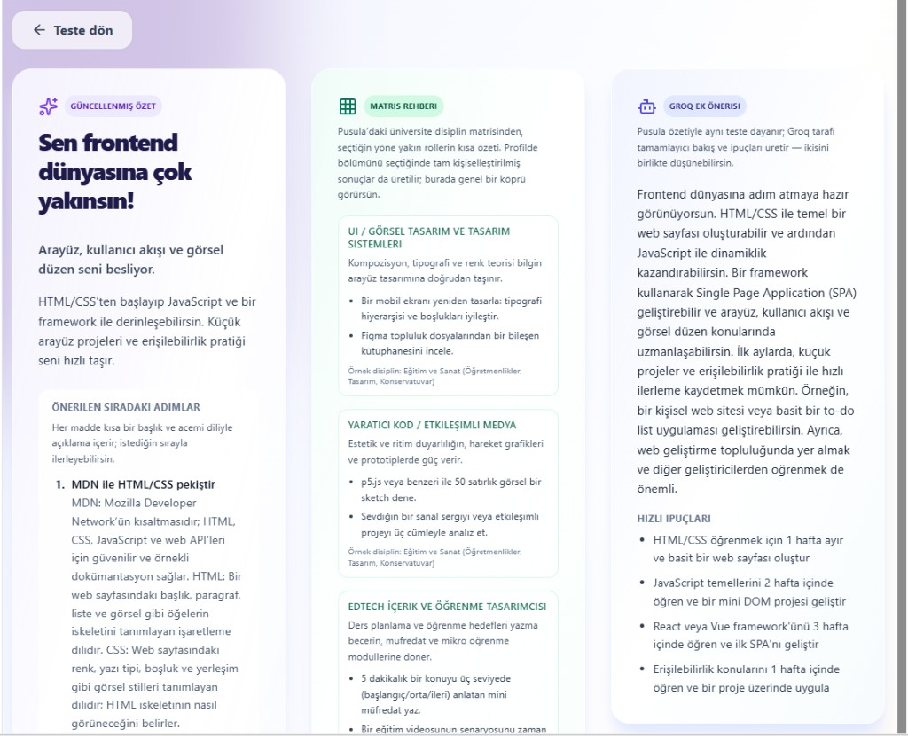
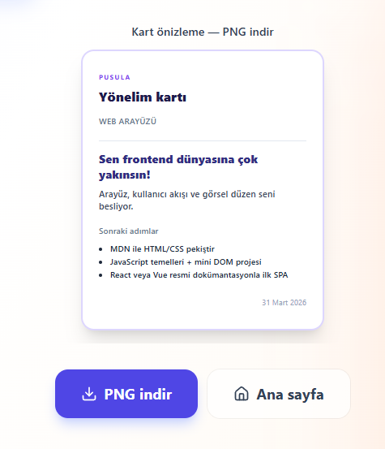
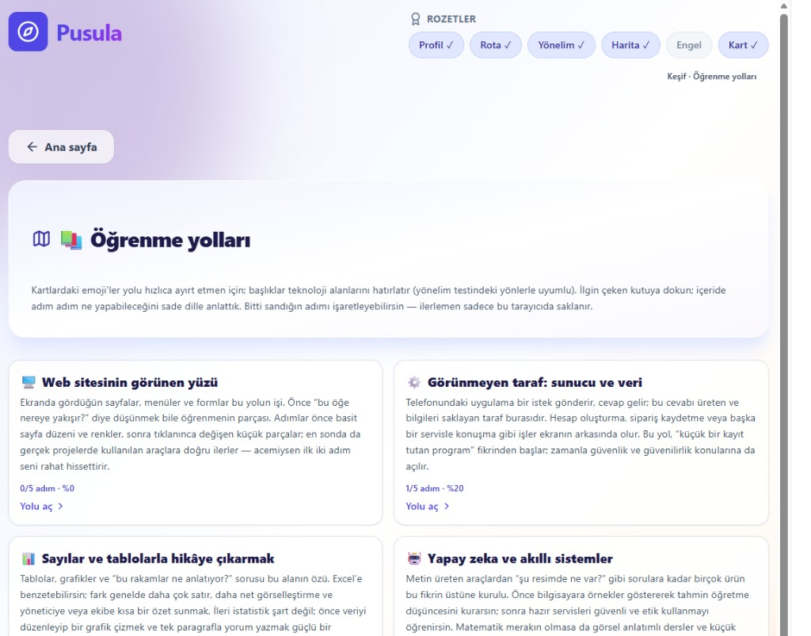
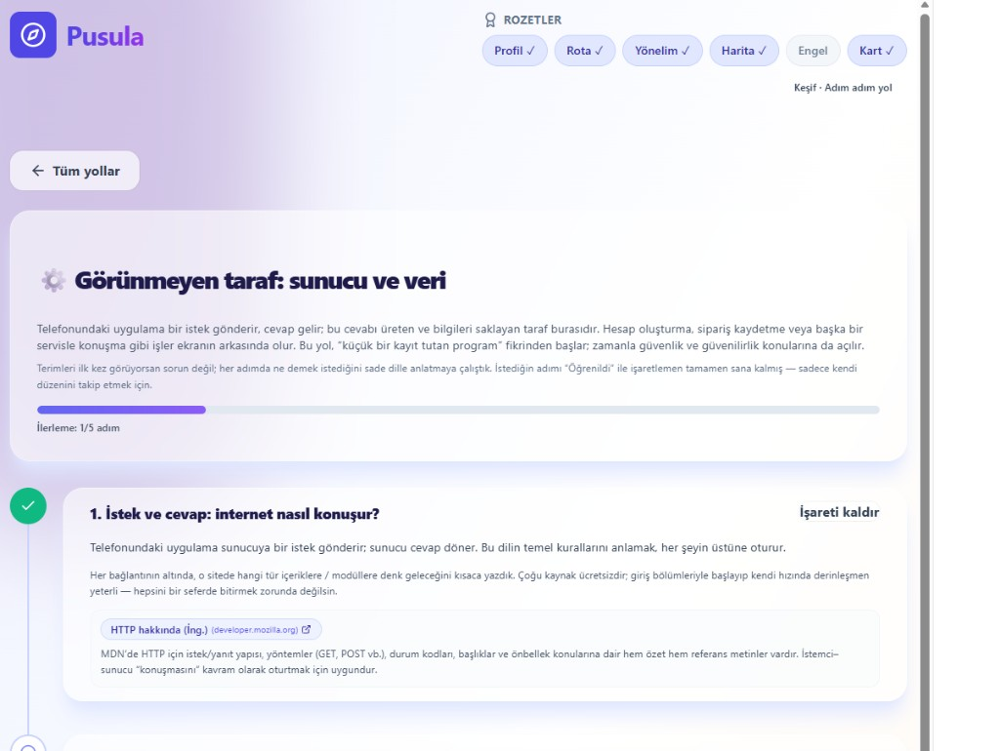

# Pusula 🧭

Pusula, üniversitede okuyan kadın öğrencilerin bölümlerinden bağımsız olarak teknoloji kariyerine güvenli bir giriş yapabilmeleri için tasarlanmış, yapay zeka destekli bir kariyer yönlendirme uygulamasıdır.

## Problem

Birçok öğrenci "Bölümüm teknolojiye ne kadar yakın?", "Nereden başlamalıyım?", "Hangi rol bana uygun?" sorularına net cevap bulamıyor. İnternette çok fazla dağınık kaynak var; ancak kişinin bölümüne, ilgilerine ve öğrenme biçimine göre kişisel bir rota çıkarmak zor.

## Çözüm

Pusula, kullanıcıdan topladığı profil sinyallerini (fakülte, bölüm, ilgi alanları, hedef, çalışma tercihi) AI ile yorumlayarak:

- uygun rol önerileri,
- başlangıç adımları,
- öğrenme yol haritaları,
- ve paylaşılabilir kariyer kartı

üretir. Böylece kullanıcı, genel tavsiyeler yerine kendine özel, uygulanabilir bir ilk planla ilerler.

## Proje Hikayesi

Bu proje benim kişisel hikayemden doğdu. Hacettepe Üniversitesi'nde İstatistik okuyorum. YKS sürecinde sıralamam yeterli olsaydı Bilgisayar Mühendisliği okumayı istiyordum; ancak hedeflediğim üniversitelerde bu bölüm gelmedi. Buna rağmen teknoloji alanında bir şeyler üretmek istiyordum ama nereden başlayacağımı bilmiyordum.

Bölüm topluluğumuzda paylaşılan programları takip ederken UP School'un "Birbirini Geliştiren Kadınlar 2026" programını gördüm. İlk modülde başarılı olanlara 46 dolar değerinde Google yapay zeka eğitimi sunuluyordu; bunun teknoloji alanında kendimi geliştirmek için atabileceğim somut bir ilk adım olabileceğini düşündüm. Bu fırsatı değerlendirip programa başvurdum ve kabul edildim.

Bu yolculukta öğrendiğim en önemli şey, doğru yönlendirme olduğunda farklı bölümlerden gelen kadınların da teknolojiye güçlü bir şekilde adım atabildiğiydi. Pusula'yı, bu bilinci ve programın ruhunu yansıtan bir bitirme projesi olarak geliştirdim. Bugün Pusula ile, teknolojiye ilk adımını atan veya yolunu arayan kadınların teknoloji yolculuğunda daha net, daha güvenli ve daha cesur adımlar atmasına katkıda bulunmayı hedefliyorum.

## AI'nın Rolü

- Profil verilerini bağlamsal olarak yorumlar.
- Rol ve alan önerilerini kişiselleştirir.
- Yönelim testini zenginleştirerek açıklayıcı aksiyon adımları üretir.
- Kariyer adımlarını daha anlaşılır ve uygulanabilir hale getirir.

## Özellikler

### 🧭 Çok Adımlı Profil ve Akış Yönetimi
Kullanıcı fakülte, bölüm, ilgi alanları, hedef ve çalışma tercihi gibi çok boyutlu profil bilgilerini adım adım girer. Her adım bir rozet olarak işaretlenir; Pusula simgesine basarak ana menüye dönülebilir.

### 🎯 Yönelim Testi — Hangi Alana Yakınsın?
6 soruluk, doğru/yanlış cevabı olmayan bir test. Her soru kullanıcının teknoloji dünyasındaki rol tipine yakınlığını ölçer. Sonuç ekranında üç katmanlı bir çıktı sunulur:

- **Güncellenmiş Özet:** Kullanıcının profiline ve test yanıtlarına göre hangi alana yakın olduğunu, neden uygun olduğunu ve ilk başlangıç adımlarını — her adımın altında teknik terimlerin sade dille açıklamasıyla birlikte — listeler.
- **Matris Rehberi:** Pusula'nın üniversite disiplin matrisinden, seçilen yöne yakın rollerin kısa özetini gösterir. Her rol için örnek başlangıç aksiyonları ve hangi disiplinlerden gelen öğrencilere uygun olduğu belirtilir.
- **Groq Ek Önerisi:** Pusula özetiyle aynı teste dayanarak Groq'un tamamlayıcı bakış açısı ve hızlı ipuçları üretilir. Zaman çizelgeli öneriler (30 gün HTML/CSS, 2 hafta JavaScript vb.) ve somut proje fikirleri içerir.

Sonuç ekranında ayrıca **Yönelim Kartı** önizlemesi yer alır; kart PNG olarak indirilebilir.

### 🗺️ Kişiselleştirilmiş Rol ve Rota Önerisi
Profil ve yönelim testi verileri Groq AI tarafından yorumlanır; kullanıcıya bölümüyle uyumlu 3-4 kariyer rolü, her rol için "Neden sana uygun?" açıklaması ve ilk 3 somut başlangıç adımı sunulur. Öneriler genel tavsiye değil; fakülte ve ilgi alanına göre kişiselleştirilmiş çıktılardır.

### 💼 Staj, Program ve Maaş Bilgisi
Her rol önerisiyle birlikte; o alanda staj veren firmalar, kendini geliştirmek için katılabileceğin programlar ve güncel maaş aralıkları hem AI çıktısı hem matris verisi olarak gösterilir. Kullanıcı "peki bu rolde ne kazanırım, nereden başlarım?" sorularına aynı ekranda yanıt bulur.

### 🚧 Engel Yeniden Çerçeveleme Adımı
"Geç kaldım", "bölümüm uygun değil", "zamanım yok" gibi kullanıcının hissettiği engeller seçilir. Groq bu engelleri analiz ederek kişiye özel, motivasyon artırıcı bir konuşma üretir. Kullanıcı ardından özgüven düzeyini tekrar seçer; başlangıç ve bitiş skorları arasındaki fark **özgüven deltası (Δ)** olarak hesaplanır.

### 🪪 İndirilebilir Kariyer Rota Kartı
Tüm akışın sonunda kullanıcının profili, önerilen roller ve özgüven deltası bir kart tasarımına dönüşür. Kart **PNG olarak indirilebilir** ve sosyal medyada paylaşılabilir. Kullanıcı kartını paylaştığında bağlantıları da Pusula'ya yönlendirilir; onlar da rota oluşturursa kullanıcıya otomatik bildirim maili gönderilir.

### 📧 E-posta ile Özet Gönderimi (n8n Otomasyonu)
Sonuçlar ekranından kullanıcı, tüm kariyer analizini (rol önerileri, maaş ve staj bağlantıları, program önerileri) tek tıkla kendi e-posta adresine gönderebilir. Arka planda n8n webhook akışı çalışır; kullanıcının elinde kalıcı, başvurulabilir bir özet belgesi olur.

### 📚 Öğrenme Yolları Modülü
6 farklı teknoloji alanı kart formatında sunulur:

- 🖥️ Web sitesinin görünen yüzü
- ⚙️ Görünmeyen taraf: sunucu ve veri
- 📊 Sayılar ve tablolarla hikâye çıkarmak
- 🤖 Yapay zeka ve akıllı sistemler
- 🚀 Kodun çalışır halde kalması
- 🧭 Kullanıcı için doğru şeyi yapmak

Her kartın açıklaması teknik jargon kullanmadan yazılmıştır. Karta tıklandığında adım adım içerik açılır; her adımın altında o konuya uygun kaynak linkleri (MDN, FastAPI, PostgreSQL dokümantasyonu vb.) ve o kaynakta ne öğreneceğine dair kısa açıklama yer alır. Kullanıcı adımı tamamladığında "Öğrenildi" olarak işaretler, ilerleme çubuğu ve adım sayacı anlık güncellenir. İlerleme bu tarayıcıda saklanır.

### 🔄 Kaldığın Yerden Devam Et
Ana sayfada "Kaldığın yerden devam et" butonu, kullanıcının daha önce tamamladığı adımları hatırlayarak akışı doğru noktadan yeniden başlatır. Rota yarıda kalmışsa sıfırdan başlamak gerekmez; bu özellik uygulamayı tek seferlik bir test olmaktan çıkarıp tekrar ziyaret edilen bir rehbere dönüştürür.

## Canlı Demo

- 🌐 Yayın Linki: https://pusula-app-two.vercel.app
- 🎬 Demo Video: [Loom Demo](https://www.loom.com/share/69c4abcb6d6b42748d136837395f6b9d)

## Ekran Görüntüleri

### Landing


### Profil Akışı


### Sonuç / Öneri


### E-posta ile Özet (Sonuçlar)
Sonuçlar sayfasında özetini adrese gönderebilirsin; arka planda n8n webhook ile işlenir. Ekran görüntüleri `assets/screenshots/` altında: `email-send.png` (uygulamada gönderim), `email-received.png` (gelen özet mail).

**Uygulamada gönderim**


**Gelen özet mail**


### Kariyer Rota Kartı


### Yönelim Testi


### Yönelim Sonuç Detayı


### Yönelim Kartı (PNG İndir)


### Öğrenme Yolları (Hub)


### Öğrenme Yolu Detayı


## Kullanılan Teknolojiler

- **Frontend:** React
- **AI:** Groq (aktif) — Gemini API entegrasyonu mevcut, geliştirme sürecinde kota sınırı nedeniyle Groq'a geçildi
- **Otomasyon:** n8n (webhook akışı)
- **Yayınlama:** Vercel

## Kullanıcı Testi

Buildathon kapsamında **7 katılımcı** ile kullanıcı testi yürüttüm. Katılımcılar uygulamayı **masaüstü bilgisayar** ile **iPhone (iOS)** ve **Android** cihazlarda denedi; ana akışı ve kritik ekranları hem geniş hem mobil görünümde gözden geçirdim. Deneyimin ardından aynı kişilerden **Google Form** üzerinden yapılandırılmış geri bildirim topladım; böylece farklı işletim sistemi ve tarayıcı ortamlarında tutarlılığı kontrol ettim.

**En sık gelen geri bildirim:** Hedef rolle uyumlu güncel staj fırsatlarının toparlanıp e-posta ile düzenli gönderilmesi istendi. Bu özellik bir sonraki sürümde önceliklendirilecek.

## Yol Haritası

Şu an yayında olan sürümü, tanımlı ürün ve teslimat hedeflerini karşılayan ve üretimde çalışan bir **temel** olarak görüyorum. Sonraki güncellemelerde **V3** kapsamında planladığım geliştirmeleri öncelik sırasıyla depoya taşımayı hedefliyorum; özellikle otomasyonun ölçeklenebilirliği, fırsat keşfi deneyimi, önceliklendirme ve veri güncelliği başlıklarında adım adım ilerlemek istiyorum.

Kapsam ve teknik iş kalemleri `tasks.md` dosyasındaki "V3 (Planlananlar)" bölümünde ayrıntılı olarak izlenebilir.

## Portfolyo Metni

Pusula, üniversitede okuyan kadın öğrencilerin teknoloji dünyasına geçişte yaşadığı belirsizlik problemini çözen AI destekli bir web uygulamasıdır. Projenin çıkış noktası, bölümü teknoloji odaklı olmayan öğrencilerin "Bana uygun alan hangisi, ilk adımı nasıl atacağım?" sorularına net bir yanıt bulamamasıydı. Pusula bu sorunu, kullanıcıdan topladığı çok boyutlu profil verisiyle ele alıyor: fakülte-bölüm bilgisi, ilgi alanları, hedefler, öğrenme stili ve çalışma tercihleri bir araya getirilerek kişisel bir rota üretiliyor.

Uygulama yalnızca tavsiye veren bir sayfa değil; adım adım ilerleyen bir deneyim sunuyor. Kullanıcı önce profilini oluşturuyor, ardından yönelim testiyle hangi teknoloji alanına daha yakın olduğunu görüyor. Sonraki aşamada AI, bu sinyalleri yorumlayıp rol önerileri, başlangıç aksiyonları ve öğrenme yol haritaları sunuyor. Ayrıca kullanıcının zorlandığı noktalar için "engel yeniden çerçeveleme" adımı eklenerek motivasyonun korunması hedefleniyor. Sürecin sonunda oluşan Kariyer Rota Kartı PNG olarak indirilebiliyor ve paylaşılabiliyor.

Pusula'nın en güçlü tarafı, teknik dili sadeleştirip eyleme dönük bir rehberliğe çevirmesidir. Bu projeyle amacım, "teknoloji kariyeri bana uzak" hissini azaltmak ve teknolojiye adım atan her kadının kendi hızında ama net bir yönle ilerleyebileceği erişilebilir bir deneyim sunmaktır.

## Geliştirme

Ön yüz `web/` klasöründedir.
```bash
cd web
npm install
npm run dev
```

Build:
```bash
cd web
npm run build
```

Ortam değişkenleri için `web/.env.example` dosyasına bakın.
