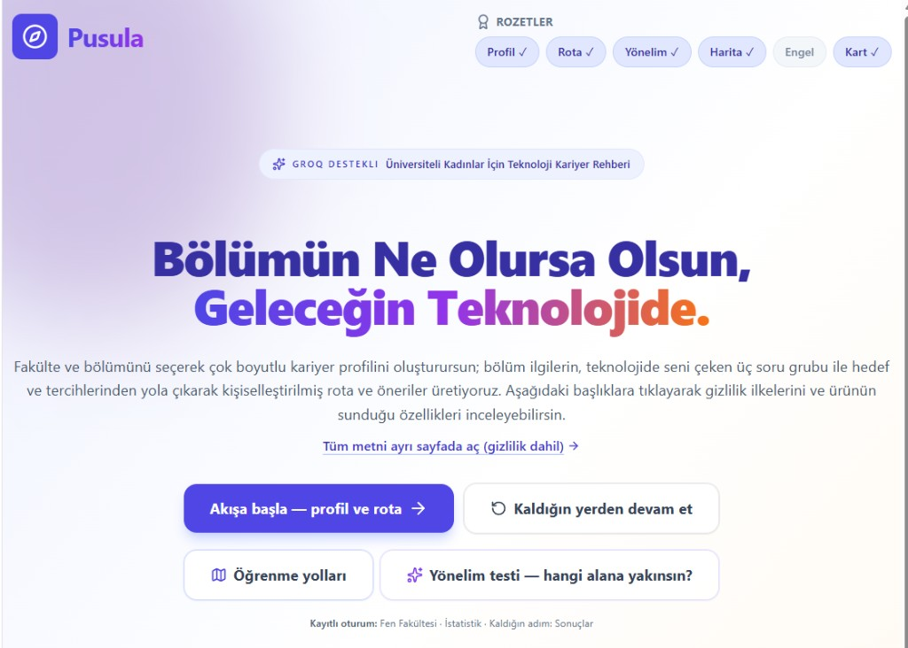
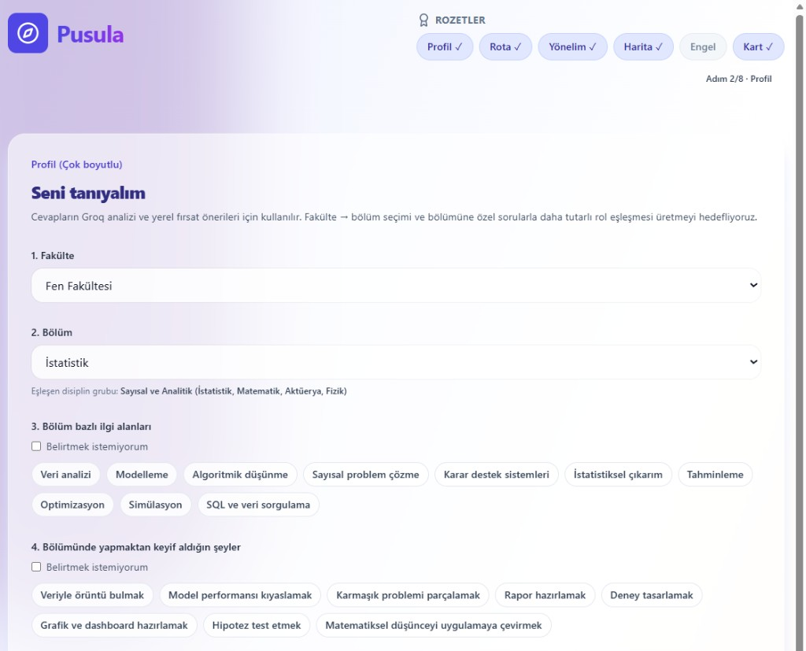
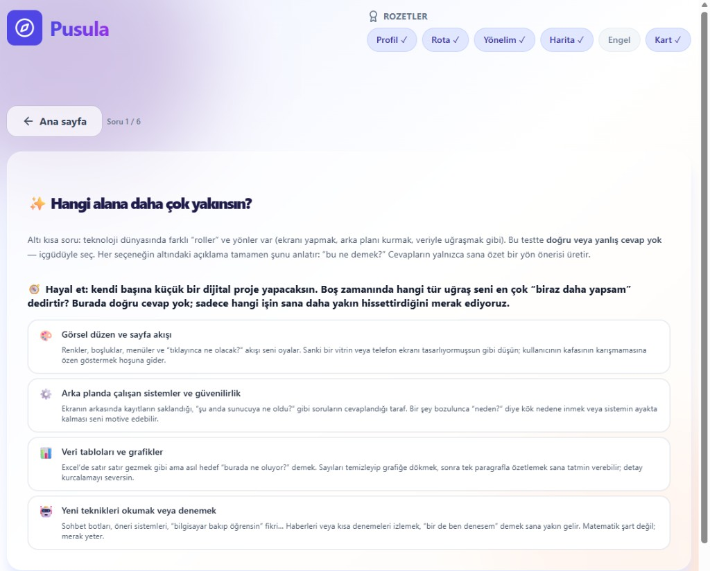
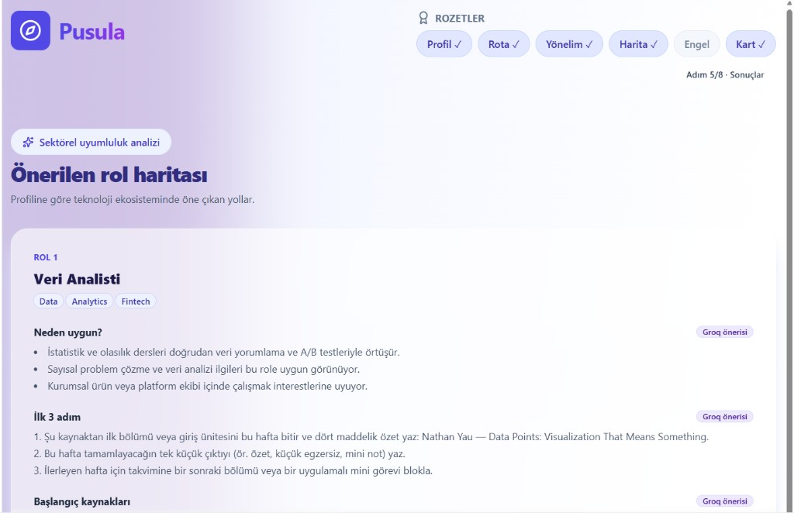
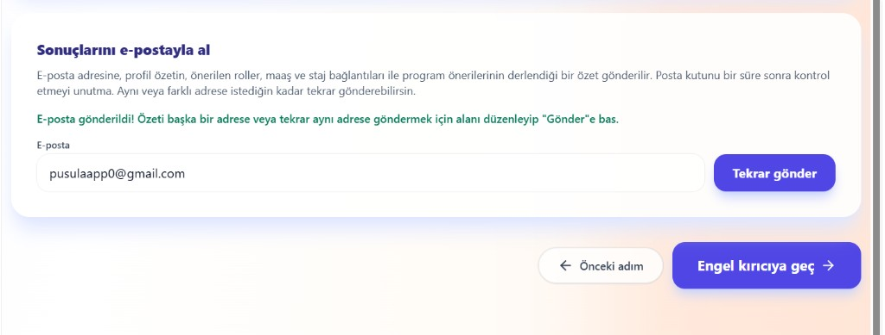
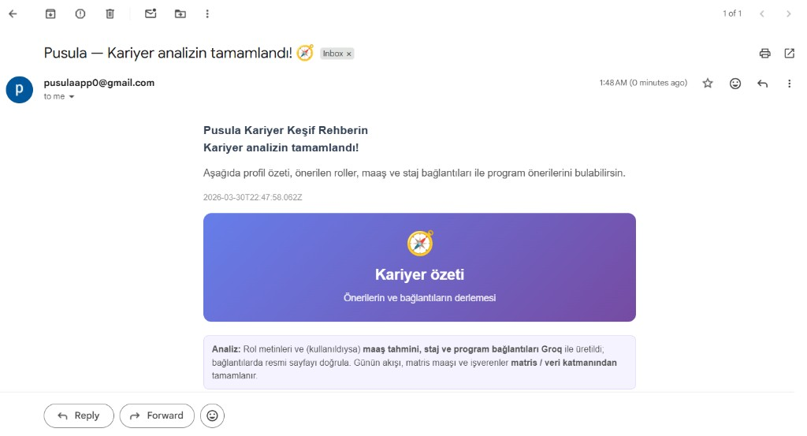
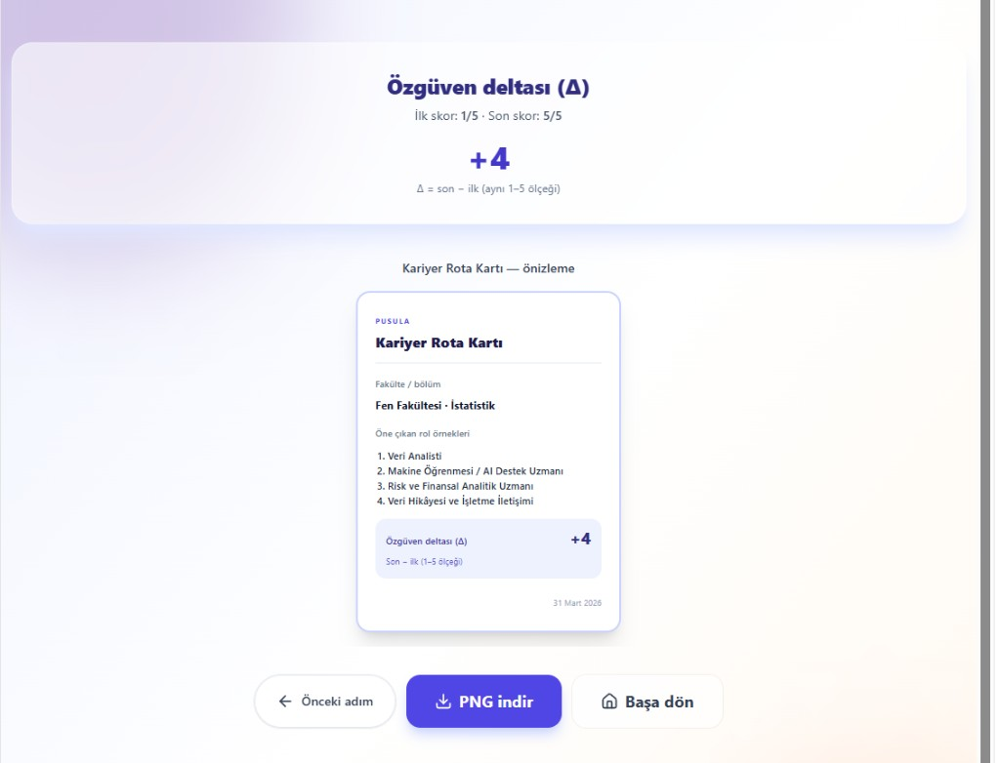

# Pusula 🧭

Pusula, universitede okuyan kadin ogrencilerin bolumlerinden bagimsiz olarak teknoloji kariyerine guvenli bir giris yapabilmeleri icin tasarlanmis, yapay zeka destekli bir kariyer yonlendirme uygulamasidir.

## Problem

Bir cok ogrenci "Bolumum teknolojiye ne kadar yakin?", "Nereden baslamaliyim?", "Hangi rol bana uygun?" sorularina net cevap bulamiyor. Internette cok fazla daginik kaynak var; ancak kisinin bolumune, ilgilerine ve ogrenme bicimine gore kisisel bir rota cikarmak zor.

## Cozum

Pusula, kullanicidan topladigi profil sinyallerini (fakulte, bolum, ilgi alanlari, hedef, calisma tercihi) AI ile yorumlayarak:

- uygun rol onerileri,
- baslangic adimlari,
- ogrenme yol haritalari,
- ve paylasilabilir kariyer karti

uretir. Boylece kullanici, genel tavsiyeler yerine kendine ozel, uygulanabilir bir ilk planla ilerler.

## Proje Hikayesi

Bu proje benim kisisel hikayemden dogdu. Hacettepe Universitesi'nde Istatistik okuyorum. YKS surecinde siralamam yeterli olsaydi Bilgisayar Muhendisligi okumayi istiyordum; ancak hedefledigim universitelerde bu bolum gelmedi. Buna ragmen teknoloji alaninda bir seyler uretmek istiyordum ama nereden baslayacagimi bilmiyordum.

Bolum toplulugumuzda paylasilan programlari takip ederken UP School'un "Birbirini Gelistiren Kadinlar 2026" programini gordum. Ilk modulde basarili olanlara 46 dolar degerinde Google yapay zeka egitimi sunuluyordu; bunun teknoloji alaninda kendimi gelistirmek icin atabilecegim somut bir ilk adim olabilecegini dusundum. Bu firsati degerlendirip programa basvurdum ve kabul edildim.

Bu yolculukta ogrendigim en onemli sey, dogru yonlendirme oldugunda farkli bolumlerden gelen kadinlarin da teknolojiye guclu bir sekilde adim atabilecegiydi. Pusula'yi, bu bilinci ve programin ruhunu yansitan bir bitirme projesi olarak gelistirdim. Bugün Pusula ile, teknolojiye ilk adımını atan veya yolunu arayan kadınların teknoloji yolculuğunda daha net, daha güvenli ve daha cesur adımlar atmasına katkıda bulunmayı hedefliyorum.

## AI'nin Rolü

- Profil verilerini baglamsal olarak yorumlar.
- Rol/alan onerilerini kisisellestirir.
- Yönelim testini zenginlestirerek aciklayici aksiyon adimlari uretir.
- Kariyer adimlarini daha anlasilir ve uygulanabilir hale getirir.

## Ozellikler

- Cok adimli profil ve akis yonetimi
- **Pusula** simgesine basarak ana menüye dönüş
- Yönelim testi + sonuc yorumlama
- AI destekli rol ve gelisim onerileri
- Yol haritasi (roadmap) modulu
- Engel yeniden cerceveleme adimi
- PNG olarak indirilebilir "Kariyer Rota Karti"
- Sonuclar ekranından **e-posta ile özet gönderimi** (n8n webhook)
- Yönelim testi sonucunu **AI ile yorumlayıp alan önerisi** (n8n webhook)

## Canli Demo

Yayin Linki: **https://pusula-app-two.vercel.app**

## Kullanici testi

Buildathon kapsaminda **7 katilimci** ile kullanici testi yuruttum. Katilimcilar uygulamayi **masaustu bilgisayar** ile **iPhone (iOS)** ve **Android** cihazlarda denedi; ben de ana akisi ve kritik ekranlari hem genis hem mobil gorunumde bu oturumlarla birlikte gozden gecirdim. Deneyimin ardindan ayni kisilerden **Google Form** uzerinden yapilandirilmis geri bildirim topladim; boylece farkli isletim sistemi ve tarayici ortamlarinda tutarliligi kontrol ettim.

## Yol haritasi (sonraki guncellemeler)

Şu an yayında olan sürümü, tanımlı ürün ve teslimat hedeflerini karşılayan ve üretimde çalışan bir **temel** olarak görüyorum. Sonraki güncellemelerde **V3** kapsamında planladığım geliştirmeleri öncelik sırasıyla depoya taşımayı hedefliyorum; özellikle otomasyonun ölçeklenebilirliği, fırsat keşfi deneyimi, önceliklendirme ve veri güncelliği başlıklarında adım adım ilerlemek istiyorum.

**Geri bildirimlerimden:** Pusula’yı deneyenlerle yaptığım görüşmelerde bana en çok şunu ilettiler: şirketlerin üniversite öğrencilerine yönelik açtığı **güncel staj fırsatlarının**, uygulamada ilerledikleri **hedef rolle uyumlu** şekilde toparlanmasını ve bu özetin **e-posta ile** düzenli olarak kendilerine ulaşmasını istiyorlar. Ben de sonraki güncellemelerde fırsat keşfini ve bildirim akışını bu ihtiyaca göre önceliklendirmeyi planlıyorum.

Kapsam ve teknik iş kalemleri `tasks.md` dosyasındaki **«V3 (Planlananlar)»** bölümünde ayrıntılı olarak izlenebilir.

## Ekran Goruntuleri

### Landing


### Profil Akisi


### Yonelim Testi


### Sonuc / Oneri


### E-posta ile ozet (Sonuclar)
Sonuclar sayfasında özetini adrese gönderebilirsin; arka planda n8n webhook ile işlenir. Ekran görüntüleri `assets/screenshots/` altında: `email-send.png` (uygulamada gönderim), `email-received.png` (gelen özet mail).

**Uygulamada gönderim**



**Gelen özet mail**



### Kariyer Rota Karti


## Portfolyo Metni (200 kelime)

Pusula, universitede okuyan kadin ogrencilerin teknoloji dunyasina geciste yasadigi belirsizlik problemini cozen AI destekli bir web uygulamasidir. Projenin cikis noktasi, bolumu teknoloji odakli olmayan ogrencilerin "Bana uygun alan hangisi, ilk adimi nasil atacagim?" sorularina net bir yanit bulamamasiydi. Pusula bu sorunu, kullanicidan topladigi cok boyutlu profil verisiyle ele aliyor: fakulte-bolum bilgisi, ilgi alanlari, hedefler, ogrenme stili ve calisma tercihleri bir araya getirilerek kisisel bir rota uretiliyor.

Uygulama yalnizca tavsiye veren bir sayfa degil; adim adim ilerleyen bir deneyim sunuyor. Kullanici once profilini olusturuyor, ardindan yonelim testiyle hangi teknoloji alanina daha yakin oldugunu goruyor. Sonraki asamada AI, bu sinyalleri yorumlayip rol onerileri, baslangic aksiyonlari ve ogrenme yol haritalari sunuyor. Ayrica kullanicinin zorlandigi noktalar icin "engel yeniden cerceveleme" adimi eklenerek motivasyonun korunmasi hedefleniyor. Surecin sonunda olusan Kariyer Rota Karti PNG olarak indirilebiliyor ve paylasilabiliyor.

Pusula'nın en güçlü tarafı, teknik dili sadeleştirip eyleme dönük bir rehberliğe çevirmesidir. Bu projeyle amacım, “teknoloji kariyeri bana uzak” hissini azaltmak ve teknolojiye adım atan her kadının kendi hızında ama net bir yönle ilerleyebileceği erişilebilir bir deneyim sunmaktır.

## Gelistirme

On yuz `web/` klasorundedir.

```bash
cd web
npm install
npm run dev
```

Build:

```bash
cd web
npm run build
```

Ortam degiskenleri icin `web/.env.example` dosyasina bakin.
